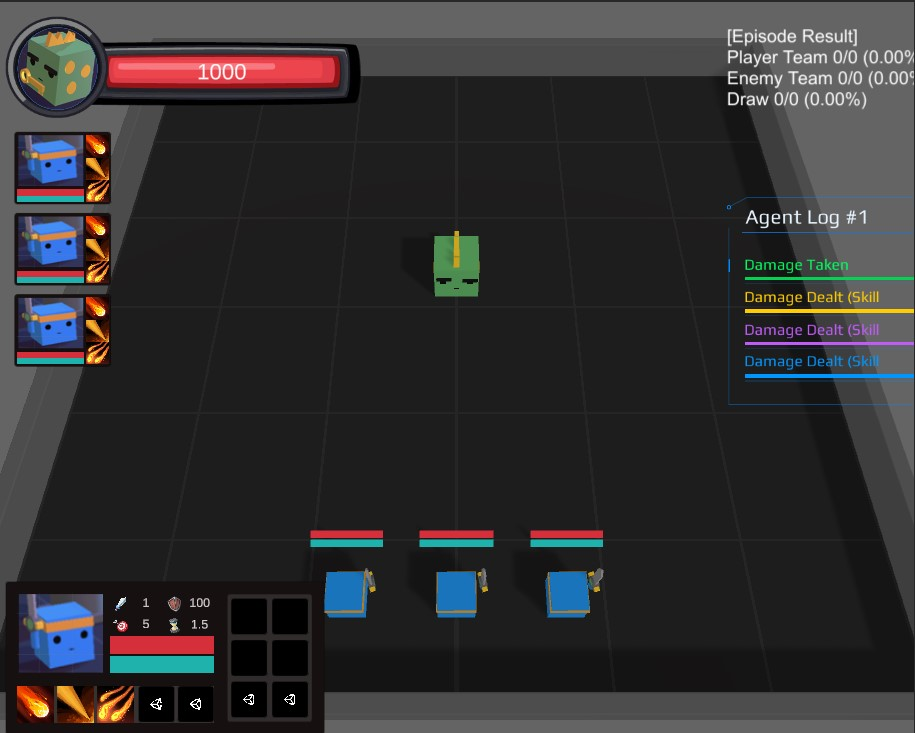

# RaidEnv




MMORPG Simulator is an open-source and computationally accessible research platform that simulates a boss-fighting 
scenario of a MMORPG game. We aim to support a broad base of multi-agent and procedural content generation (PCG) research that
would be impractical or impossible to conduct in other environments.


## Getting Started
### Environment Setup

1. Install the Unity Editor with version [`2020.3.25f1`](https://unity3d.com/get-unity/download/archive)
2. Install the Unity ml-agents from this [repository](https://github.com/Unity-Technologies/ml-agents)
 ```
 pip install --target $PATH_TO_INSTALL$ mlagents=0.28   
 ```   

### Usage

Workspace: `/Project/Assets/ML-Agents/Examples/MMORPG`


## Game Description
The genre of this game is MMORPG (Massively Multiplayer Online Role-Playing Game) and implements a boss fighting scenario.   
A dragon (boss) attacks multiple players from a distance to kill all, and players with various classes also use their skills to slay dragons.  
There are several player classes:
(add class description with their skills)

This is the key for playing in Unity play mode.

| Key    | Description                          |
|:------:|--------------------------------------|
| `A, D` | Turn `Player 1`                      |
| `W, S` | Move `Player 1`                      |
| `1`    | Use `Skill 1`                        |
| `2`    | Use `Skill 2`                        |
| `K`    | Kill `Player 1` (Set health to zero) |
| `R`    | Reset Episode                        |

## Training Playtesting Agents

To train multi-agents, in addition to downloading and opening this environment, you will need to install the 
[ML-Agents Python package](https://github.com/Unity-Technologies/ml-agents/blob/release_18_docs/docs/Installation.md#install-the-mlagents-python-package).
Follow the [getting started guide](https://github.com/Unity-Technologies/ml-agents/blob/release_18_docs/docs/Getting-Started.md) for more information on how to use the ML-Agents trainers.

    
    mlagents-learn /app/MA/{RL_HEURISTIC/RL_GENERALIZATION}/configs/{CONFIG_NAME}.yaml --env=/app/envs/MMORPG_Linux/MMORPG_Training.x86_64 --no-graphics --force --run-id=mmorpg1

You will need to use the MMORPG_training.unity scenes for training.  
A configuration YAML (Experiment/MA/RL_GENERALIZATION/configs or Experiment/MA/RL_HEURISTIC/configs) for ML-Agents is provided. 
Depending on your computer's capabilities, you can uncomment and increase the number of environments (num_envs).


### Reward Shaping
To produce the results in the paper, we used the default environment as it is in this repo. 
However, we also provide environment parameters to adjust reward functions and control the environment from the trainer. 
In multi-agent docs, you can find more details about state, action, and reward variables.

| Parameters         | Description                                                                                      |
|:------------------:|--------------------------------------------------------------------------------------------------|
| `Shooting Reward`  | (default = `+0.01`) A reward given to an agent at every step for a shooting it use               |
| `Hit Reward`       | (default = `+0.05`) A reward given to an agent when it hits a dragon with their shooting skills  |
| `Win Group Reward` | (default = `+1.0`) A reward given to the team if they kill a dragon                              |

## Training PCG Agent
You can generate the contents in the game by adjusting the value of the interface of each generator prefab or
by substituting the source value in the OverallGenerator.


## Customizable Features
| Parameter Category      | Parameter Type  | Parameter Name       | Data Type | Range         | Description                                                     |
|------------------------|-----------------|----------------------|-----------|---------------|-----------------------------------------------------------------|
| Character Statistics    | Status          | Health Point         | integer   | [0, 1000]     | Maximum number that agent can be dealing with the damage      |
|                        |                 | Manna Point          | integer   | [0, 100]      | The resource that used when agent active a skill               |
|                        |                 | Spell Power          | integer   | [0, 100]      | Reference number used when calculating the skill damage        |
|                        |                 | Movement Speed       | float     | [1, 2]        | Move speed of the agent                                        |
|                        | Attack          | Power                | integer   | [0, 100]      | Reference number used when calculating the melee attack damage |
|                        |                 | Range                | integer   | [1, 10]       | Maximum distance of the melee attack can be reached            |
|                        |                 | Speed                | float     | [1, 2]        | Number of melee attacks can be activated per second            |
|                        | Defensive        | Armor                | integer   | [0, 100]      | Ratio that agent dealt reduced damage                           |
|                        |                 | Evasion              | integer   | [0, 100]      | Probability that agent can dodge melee attack or skill         |
|                        |                 | Parry                | float     | [0, 100]      | Probability that agent can block melee attack or skill         |
|                        | Primary         | Strength             | integer   | [1, 100]      | Measure of physical power and proficiency                      |
|                        |                 | Agility              | integer   | [1, 100]      | Measure of swiftness                                           |
|                        |                 | Intelligence         | integer   | [1, 100]      | Measure of mental power and magical prowess                    |
|                        | Secondary       | Critical             | integer   | [0, 100]      | Chance that agent ability can be more effective than normal    |
|                        |                 | Haste                | integer   | [0, 100]      | Determine the agent's action swiftness                         |
|                        |                 | Versatility          | integer   | [0, 100]      | Increase the agent's attack and defensive abilities effect     |
|                        |                 | Mastery              | integer   | [0, 100]      | Enhance some abilities effect to emphasize character class     |
| Skill                  | Information     | Name                 | string    | -             | Name given to each skill                                       |
|                        |                 | Trigger Type         | enum      | [0, 1]        | Determine the skill is active skill or passive skill           |
|                        |                 | Magic School         | enum      | [0, 9]        | Determine the visual effects of the skill (e.g. fire, frost)   |
|                        |                 | Hit Type             | enum      | [0, 1]        | Determine if the skill is a melee attack or skill              |
|                        |                 | Target Type          | enum      | [0, 2]        | Type of target which the skill can be used on                 |
|                        |                 | Projectile Speed     | float     | [0, 50]       | Speed of the projectile that reaches the target                |
|                        |                 | Affect on Ally       | bool      | True/False    | Determine if an agent can activate a skill on an ally           |
|                        |                 | Affect on Enemy      | bool      | True/False    | Determine if an agent can activate a skill on an enemy          |
|                        | Condition       | Cool Time            | float     | [0, 60]       | Amount of time required to activate the skill again            |
|                        |                 | Cast Time            | float     | [0, 2]        | Amount of time required to execute the skill after activation  |
|                        |                 | Cost                 | float     | [0, 100]      | Amount of Mana required to activate the skill                  |
|                        |                 | Range                | float     | [1, 20]       | Maximum distance of the skill can be reached                   |
|                        |                 | Charge               | integer   | [1, 3]        | Number of skill activations regardless of the Cool time        |
|                        |                 | Cast on moving       | bool      | True/False    | Determine if an agent can activate a skill during movement      |
|                        |                 | Cast on Casting      | bool      | True/False    | Determine if an agent can activate a skill during casting       |
|                        |                 | Cast on Channeling   | bool      | True/False    | Determine if an agent can activate a skill during executing     |
|                        | Coefficient    | Value                | float     | [0, 2]        | Scaling factor that determines the damage of the skill         |


