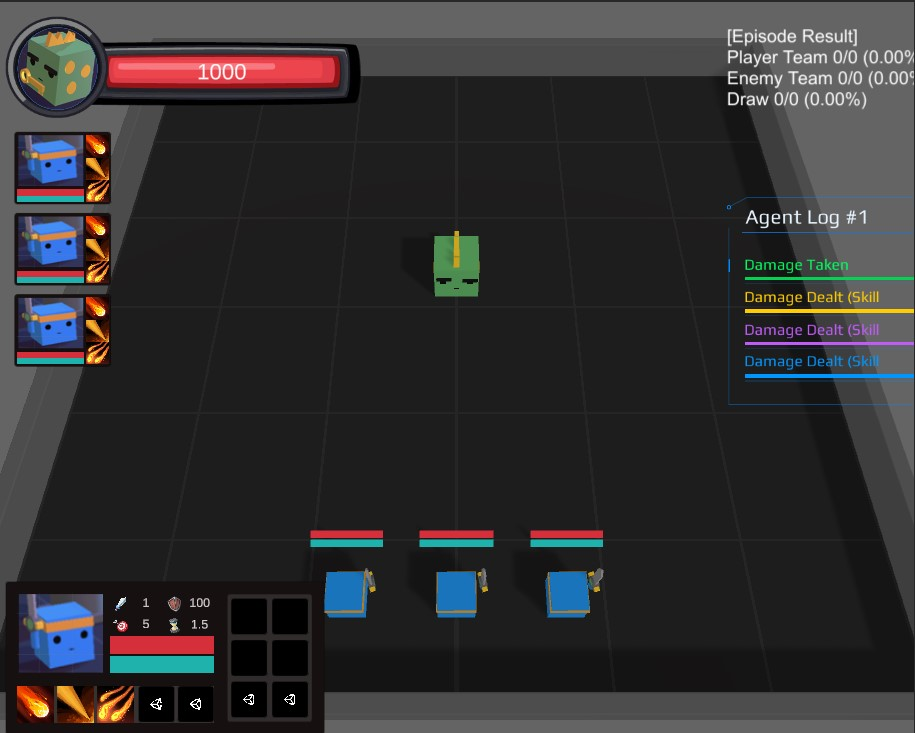

<h1 align="center"> MMORPG Simulator </h1>
<h3 align="center"> Unity-based Research Platform </h3>


<!-- ABOUT THE PROJECT -->
<h1 id="about-the-project"> About The Project</h1>



<p align="justify">
  MMORPG Simulator is an open-source and computationally accessible research platform that simulates a boss fighting 
scenario of a MMORPG game. Our goal is to support a broad base of multi-agent and procedural content generation (PCG) research that
would be impractical or impossible to conduct on other environments.
</p>


<!-- GETTING STARTED -->
<h1 id="getting-started"> Getting Started</h1>
<h2 id="environment-setup"> Environment Setup</h2>

1. Install the Unity Editor with version [`2020.3.25f1`](https://unity3d.com/get-unity/download/archive)
2. Install the Unity ml-agents from [github](https://github.com/Unity-Technologies/ml-agents)
    ```
    pip install --target $PATH_TO_INSTALL$ mlagents=0.28   
    ```   
   
<h3 id="usage"> Usage</h3>


-  Workspace: `/Project/Assets/ML-Agents/Examples/MMORPG`


<!-- Game Description -->
<h1 id="game-description"> Game Description</h1>

The genre of this game is MMORPG (Massively Multiplayer Online Role-Playing Game) and implements a boss fighting scenario.   
A dragon (boss) attacks multiple players from a distance to kill all, and players with various classes also use their skills to slay dragons.  
There are several player classes:
(add class description with their skills)

This is the key for playing in Unity play mode.

| Key    | Description                          |
|:------:|--------------------------------------|
| `A, D` | Turn `Player 1`                      |
| `W, S` | Move `Player 1`                      |
| `1`    | Use `Skill 1`                        |
| `2`    | Use `Skill 2`                        |
| `K`    | Kill `Player 1` (Set health to zero) |
| `R`    | Reset Episode                        |


<!-- Training -->
<h1 id="training"> Training</h1>

To train multi-agents, in addition to downloading and opening this environment, you will need to install the 
[ML-Agents Python package](https://github.com/Unity-Technologies/ml-agents/blob/release_18_docs/docs/Installation.md#install-the-mlagents-python-package).
Follow the [getting started guide](https://github.com/Unity-Technologies/ml-agents/blob/release_18_docs/docs/Getting-Started.md) for more information on how to use the ML-Agents trainers.

    
    mlagents-learn /app/ml-agents-dodgeball-env/MMORPG.yaml --env=/app/envs/MMORPG_Linux/MMORPG_Training.x86_64 --no-graphics --force --run-id=mmorpg1

You will need to use the MMORPG_training.unity scenes for training.  
A configuration YAML (MMORPG.yaml) for ML-Agents is provided. 
You can uncomment and increase the number of environments (num_envs) depending on your computer's capabilities.

<!-- Environment Parameters -->
<h2 id="environment-parameters"> Environment Parameters</h2>
To produce the results in the paper, we used the default environment as it is in this repo. 
However, we also provide environment parameters to adjust reward functions and control the environment from the trainer. 
You can find more details about state, action, and reward variables in multi-agent docs.

| Parameters         | Description                                                                                      |
|:------------------:|--------------------------------------------------------------------------------------------------|
| `Shooting Reward`  | (default = `+0.01`) A reward given to an agent at every step for a shooting it use               |
| `Hit Reward`       | (default = `+0.05`) A reward given to an agent when it hits a dragon with their shooting skills  |
| `Win Group Reward` | (default = `+1.0`) A reward given to the team if they kill a dragon                              |

<!-- Procedural Content Generation (PCG) -->
<h2 id="procedural-content-generation"> Procedural Content Generation (PCG)</h2>
You can generate the contents in the game by adjusting the value of the interface of each generator prefab or
by substituting the source value in the OverallGenerator.


